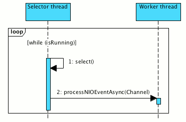
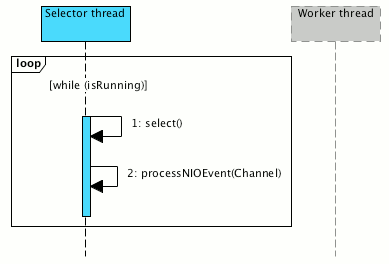
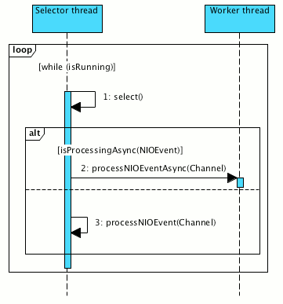
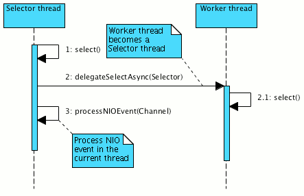

### IOStrategies

使用 NIO 时，我们问的本质问题是，我们将如何处理发生在 NIO channel 上的特定 NIO 事件。
通常我们有两个选项：处理当前（选择器）线程中的 NIO 事件或将其传递给工作线程进行处理。

#### 1. Worker-thread IOStrategy.

最有用的IOStrategy，其中选择器线程(Selector thread)将NIO事件处理委托给工作线程(worker threads)。



该IOStrategy具有很好的可扩展性和安全性。我们可以根据需要更改选择器(selector)和工作(worker)线程池的大小，
并且不存在在特定NIO事件处理期间可能发生的某些问题会影响在同一选择器上注册的其他通道的风险。

#### 2. Same-thread IOStrategy.

可能是最有效的IOStrategy。
与 work-thread IOStrategy不同，same-IOStrategy处理当前线程中的NIO事件，从而避免了昂贵的线程上下文切换。



由于我们可以调整选择器线程池的大小，所以此IOStrategy仍具有很好的可伸缩性，但是它确实有缺点。需要注意的是，
通道NIO事件处理不会阻塞或执行任何长时间的操作，因为它可能会阻塞对同一选择器上发生的其他NIO事件的处理。

#### 3. Dynamic IOStrategy.

如前所述，worker-thread 和 same-thread 策略具有明显的优缺点。
但是，如果策略可以根据当前条件（负载 load，收集的统计信息 gathered statistics等）尝试在运行时智能地交换它们，该怎么办？



该 IOStrategy 可能会带来很多好处，并可以更好地控制资源。但是，重要的是不要使条件评估逻辑过于复杂，
因为它的复杂性将使IOStrategy与以前的两种策略相比效率低下。

#### 4. Leader-follower IOStrategy.
Grizzly 2.3附带的最后一个IOStrategy是跟随者策略(leader-follower strategy)：



该IOStrategy与 worker-thread IOStrategy相似，但不是将NIO事件处理传递给 worker thread，
而是把Selector对 selector-thread 的控制权传给work-thread，将工作线程更改为选择器线程，
并且实际的NIO事件处理在当前线程中进行。

Grizzly 2.3提供了通用接口org.glassfish.grizzly.IOStrategy：
```java
package org.glassfish.grizzly;

import org.glassfish.grizzly.strategies.WorkerThreadPoolConfigProducer;

import java.io.IOException;
import java.util.concurrent.Executor;

/**
 * <tt>strategy</tt> is responsible for making decision how
 * {@link Runnable} task will be run: in current thread, worker thread.
 *
 * <tt>strategy</tt> can make any other processing decisions.
 * 
 * @author Alexey Stashok
 */
public interface IOStrategy extends WorkerThreadPoolConfigProducer {

    /**
     * The {@link org.glassfish.grizzly.nio.SelectorRunner} will invoke this
     * method to allow the strategy implementation to decide how the
     * {@link IOEvent} will be handled.
     *
     * @param connection the {@link Connection} upon which the provided
     *  {@link IOEvent} occurred.
     * @param ioEvent the {@link IOEvent} that triggered execution of this
     *  <code>strategy</code>
     *
     * @return <tt>true</tt>, if this thread should keep processing IOEvents on
     * the current and other Connections, or <tt>false</tt> if this thread
     * should hand-off the farther IOEvent processing on any Connections,
     * which means IOStrategy is becoming responsible for continuing IOEvent
     * processing (possibly starting new thread, which will handle IOEvents).
     *
     * @throws IOException if an error occurs processing the {@link IOEvent}.
     */
    boolean executeIoEvent(Connection connection, IOEvent ioEvent)
    throws IOException;

    /**
     * The {@link org.glassfish.grizzly.nio.SelectorRunner} will invoke this
     * method to allow the strategy implementation to decide how the
     * {@link IOEvent} will be handled.
     *
     * @param connection the {@link Connection} upon which the provided
     *  {@link IOEvent} occurred.
     * @param ioEvent the {@link IOEvent} that triggered execution of this
     *  <code>strategy</code>
     * @param isIoEventEnabled <tt>true</tt> if IOEvent is still enabled on the
     *  {@link Connection}, or <tt>false</tt> if IOEvent was preliminary disabled
     *  or IOEvent is being simulated.
     *
     * @return <tt>true</tt>, if this thread should keep processing IOEvents on
     * the current and other Connections, or <tt>false</tt> if this thread
     * should hand-off the farther IOEvent processing on any Connections,
     * which means IOStrategy is becoming responsible for continuing IOEvent
     * processing (possibly starting new thread, which will handle IOEvents).
     *
     * @throws IOException if an error occurs processing the {@link IOEvent}.
     */
    boolean executeIoEvent(Connection connection, IOEvent ioEvent,
            boolean isIoEventEnabled) throws IOException;
    
    /**
     * Returns an {@link Executor} to be used to run given <tt>ioEvent</tt>
     * processing for the given <tt>connection</tt>. A <tt>null</tt> value will
     * be returned if the <tt>ioEvent</tt> should be executed in the kernel thread.
     * 
     * @param connection
     * @param ioEvent
     * @return an {@link Executor} to be used to run given <tt>ioEvent</tt>
     * processing for the given <tt>connection</tt>
     */
    Executor getThreadPoolFor(Connection connection, IOEvent ioEvent);
}
```
IOStrategy实现可以决定如何处理特定的NIO事件。

根据上面的列表，Grizzly 2.3具有四个预定义的IOStrategy实现：
- org.glassfish.grizzly.strategies.WorkerThreadIOStrategy
- org.glassfish.grizzly.strategies.SameThreadIOStrategy
- org.glassfish.grizzly.strategies.SimpleDynamicThreadStrategy
- org.glassfish.grizzly.strategies.LeaderFollowerIOStrategy
这些策略是按传输分配的，因此可以使用 Transport's get/setIOStrategy 方法获取/设置 IOStrategy.
TCP 和 UDP transports 默认使用 worker-thread IOStrategy.


