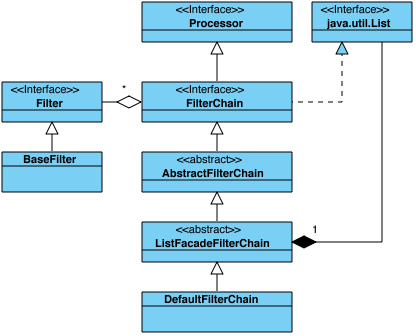
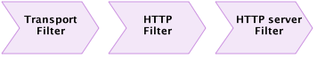
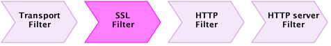
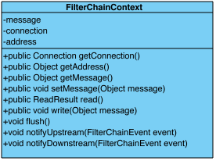

### FilterChains and Filters
在前面的部分中，我们提到了Processor，它的角色-处理发生在Grizzly * Connection * s上的 I/O 事件。
所述FilterChain是 Grizzly 中使用的最有用的类型的处理器。



根据名称所描述的那样，FilterChain是 **Filter**s 的链。每个Filter代表要执行的处理工作的一个单元，
其目的是检查和/或修改由FilterChainContext表示的事务的状态。

为了让您了解FilterChain的外观，下面是FilterChain的示例，该示例实现了HTTP服务器逻辑：


+ TransportFilter 负责从网络连接读取数据到 Buffer，并将数据从缓冲区写入到网络连接
+ HttpFilter 负责 Buffer <-> HttpPacket 转换（双向）
+ HttpServerFilter负责处理请求 **HttpPacket**s 并生成响应 **HttpPacket**s，
并将它们以相反的方向（HttpServerFilter-> HttpFilter-> TransportFilter）发送回FilterChain。

那么，如果我们要实现HTTPS服务器呢？这很简单：

我们仅添加一个SSLFilter，负责对SSL安全数据进行编码/解码。

如我们所见，在处理任何I / O事件期间，FilterChain中的过滤器将按特定顺序执行。
**重要的是要记住，除了WRITE事件外，大多数 I/O事件都是从第一个过滤器到最后一个处理（从上面的模式从左到右）处理的，
而WRITE事件的处理是从链中的最后一个过滤器开始到第一个（从右到左）处理的。上面的模式）。**

让我们定义一些**术语**以使以下描述更清楚：
+ Upstream 上游， 从此过滤器到链中最后一个过滤器的方向（在以上架构中从左到右）；
+ Downstream 下游，从此过滤器到链中第一个过滤器的方向（在上述架构中从右到左）；

让我们看一下 FilterChain 可以处理哪些 I/O 事件，为此，我们可以看一下 Filter 接口方法：
```java
public NextAction handleRead(FilterChainContext ctx) throws IOException;

public NextAction handleWrite(FilterChainContext ctx) throws IOException;

public NextAction handleConnect(FilterChainContext ctx) throws IOException;

public NextAction handleAccept(FilterChainContext ctx) throws IOException;

public NextAction handleClose(FilterChainContext ctx) throws IOException;
```

所以 I/O 事件有
+ READ：可以从连接(Connection)中获得数据，可以对其进行读取和处理；
+ WRITE： 数据将被写入到连接(Connection)中，并且Filter可能负责转换数据表示形式，例如HttpPacket- > 上面模式中的Buffer；
+ CONNECT：新客户端连接已连接；
+ ACCEPT（仅限TCP）：新的客户端连接已被服务器接受连接（TCPNIOServerConnection）;
+ CLOSE：连接已关闭（本地或对端）；

**重要的是要记住，特定连接上的相同 I/O 事件是串行处理的。例如，如果我们在连接 "A" 上处理 READ I/O 事件，
则在上一个 READ I/O 事件的处理完成之前，Grizzly 将永远不会开始在同一连接 "A" 上处理另一个 READ I/O 事件。
如果用户决定拥有 I/O 事件处理的所有权，则仍应遵守串行事件处理的"规则"。**

另外，FilterChain 筛选器(filters) 能够启动和处理自定义事件通知。事件发起者可以选择通过FilterChain在上游或下游发出事件，例如：
```java
public NextAction handleRead(FilterChainContext ctx) throws IOException {
        // Here we decide to notify downstream Filters 这里我们决定通知下游过滤器 
        ctx.notifyDownstream(new OneEvent(...));

        // Notify upstream Filters 通知上游过滤器 
        ctx.notifyUpstream(new AnotherEvent(...));
}
```

FilterChain 中的过滤器(Filters) 可以通过实现以下方法来拦截和处理自定义事件：
```java
public NextAction handleEvent(FilterChainContext ctx, FilterChainEvent event) throws IOException;
```
如我们所见，每个 Filter "handle" 方法都有 FilterChainContext 参数，并返回 NextAction 结果。


FilterChainContext表示一个上下文（状态）Context(status)，与特定 Connection 上特定 I/O 事件的处理相关联，
因此其生命周期绑定到单个I / O事件的处理。

FilterChainContext包含以下状态信息：

#### Connection 
发生 Connection I/O 事件；

#### Address
对等地址。在大多数情况下，它返回与 Connection.getPeerAddress() 相同的值，
除非在我们处理未绑定 UDP 连接上的 READ 事件的情况下。在这种情况下，FilterChainContext.getAddress() 
将返回发送数据的对等方的地址；

#### Message
正在处理的消息。这是过滤器在 I/O 事件处理期间可能更改的唯一值。通常在传入/传出消息解析/序列化期间使用它。
每个过滤器都能够获取初始消息数据，将其转换为不同的表示形式，将其放回原处，并将处理传递给链中的下一个过滤器。

例如，当处理 READ 事件时，HttpFilter从FilterChainContext获取消息作为Grizzly Buffer，将其转换为HttpPacket，
将 HttpPacket 设置回 FilterChainContext 消息，然后将控制权传递给 HttpServerFilter，
后者将从 FilterChainContext 获取 HttpPacket 并对其进行处理。

除了保持状态外，FilterChainContext还支持常用的 I/O 操作：

#### Read
```java
ReadResult readResult = ctx.read();
```
此操作从该过滤器（不包括）上游的链中的第一个过滤器（包括）开始执行阻塞的FilterChain读取。
当对 READ I/O 事件的处理将到达当前 Filter 时，该操作将返回结果，并且 FilterChain 将要调用此 Filter的handleRead（…）操作。

#### Write
```java
ctx.write(message);

// or 

ctx.write(message, completionHandler)

// or

ctx.write(address, message, completionHandler); //Unbound UDP only
```
此操作从第一个过滤器（含）之后的此过滤器（不含）开始执行无阻塞 FilterChain 写入。
此操作从此 Filter（独占）开始在 FilterChain 上启动 WRITE I/O 事件的处理。

#### Flush 
```java
ctx.flush();
//or
ctx.flush(completionHandler);
```
此操作初始化并通知下游筛选器(filters)有关特殊的 TransportFilter.FlushEvent 的信息，
以便每个筛选器都能够处理此事件，并确保所有缓存的数据均已写入Connection。

#### Event notification
```java
ctx.notifyUpstream(event);
// or
ctx.notifyDownstream(event);
```
该操作将特定FilterChainEvent通知给FilterChain中的所有上游/下游Filter 。

### NextAction

如前所述，在处理 I/O 事件期间，除了WRITE事件（从最后一个Filter到first进行处理）外，
FilterChain 从头到尾依次调用Filters。同时，过滤器可以通过返回不同类型的 NextAction 来更改默认的 I/O 事件处理顺序：

#### StopAction

```java
return ctx.getStopAction();
```
指示FilterChain停止处理此I / O事件。通常，如果没有足够的数据来继续FilterChain处理，或者它是链中的最后一个Filter，则返回StopAction。

StopAction可以参数化：
```java
return ctx.getStopAction(incompleteChunk);
// or
return ctx.getStopAction(incompleteChunk, appender);
```
StopAction中的incompleteChunk意味着没有足够的数据来继续FilterChain处理。随着更多数据可用，但在FilterChain调用Filter之前，它将检查Filter在上一次调用之后是否存储了任何数据。如果存在一个不完整的块，它将新数据追加到存储的数据中，并将结果作为FilterChainContext消息传递。

注意：incompleteChunk应该是“可附加的”，因此FilterChain将知道如何将新的数据块附加到存储的块中。因此，incompleteChunk应该实现org.glassfish.grizzly.Appendable或org.glassfish.grizzly.Appender作为附加参数。

#### InvokeAction
```java
return ctx.getInvokeAction();
```
指示FilterChain根据自然执行顺序在链中运行下一个Filter。
可以使用 **incompleteChunk** 参数创建InvokeAction ：
```java
return ctx.getInvokeAction(incompleteChunk, appender);
```
这会指示FilterChain存储incompleteChunk并像执行非参数化版本一样继续执行FilterChain。

此功能对于从源缓冲区解析一条消息或几条消息并发现存在剩余数据量不足以转换为应用程序消息的情况特别有用。因此，
开发人员可以继续使用已解析的消息进行FilterChain处理，并存储incompleteChunk余数。随着更多数据可用，
但在FilterChain再次调用Filter之前，它将检查Filter在上一次调用之后是否存储了任何数据。
如果存在一个不完整的块，它将新数据追加到存储的数据中，并将结果作为FilterChainContext消息传递。

注意：incompleteChunk应该是“可附加的”，因此FilterChain将知道如何将新的数据块附加到存储的块中。
因此，incompleteChunk应该实现org.glassfish.grizzly.Appendable或org.glassfish.grizzly.Appender作为附加参数。

另一种选择是创建具有的InvokeAction **unparsedChunk** 参数：
```java
return ctx.getInvokeAction(unparsedChunk);
```
这指示FilterChain存储unparsedChunk并像执行非参数化版本一样继续执行FilterChain。与上述“ incompleteChunk”情况不同，
这次我们不知道unparsedChunk是否具有足够的数据可转换为应用程序消息。一旦FilterChain执行完成，将恢复链中最新的Filter的unparsedChunk，将立即从存储了unparededChunk的Filter开始重新初始化FilterChain处理。

对于从源缓冲区解析消息并发现缓冲区包含剩余部分（可能包含也可能不包含更多消息）的情况，此功能特别有用。
这使开发人员可以提取第一条消息，并在当前消息处理完成后保存其余要处理的消息。

#### RerunFilterAction
```java
return ctx.getRerunFilterAction();
```
指示 FilterChain 重新运行一次此 Filter。这对于简化 I/O 事件处理代码并避免递归很有用。

#### SuspendAction
```java
return ctx.getSuspendAction();
```
指示 FilterChain 终止（离开）当前线程中的 I/O 事件处理。用户将可以通过调用来恢复 I/O 事件处理.
+ ctx.resume(): 在暂停的同一过滤器上恢复处理。
+ ctx.resume(NextAction): 在被暂停的相同Filter上恢复处理，但不将控制权传递给Filter-它模拟Filter的处理完成，就像它返回NextAction作为结果一样
+ ctx.resumeNext(): 在挂起的过滤器旁边的过滤器处恢复处理。 和 ctx.resume(ctx.getInvokeAction()) 相同.

请注意，在返回 SuspendAction 之后，在继续 I/O 事件处理之前，Grizzly 将不会在同一Connection上初始化相同的 I/O 事件处理。
例如，如果我们在 READ 事件处理期间返回 SuspendAction，则 Grizzly 不会通知 FilterChain 有关同一 Connection 上的任何新数据的通知，
直到已暂停事件的 READ 事件完成为止。

#### ForkAction (was SuspendStopAction)
```java
return txt.getForkAction();
```
这个动作是非常相似的 **SuspendAction**，除了一件重要的事情。获取 ForkAction 之后，Grizzly将继续监听Connection上的相同I / O事件，并在发生时通知FilterChain。
使用NextAction时要格外小心，以确保两个或多个线程不会同时处理同一I / O操作。


