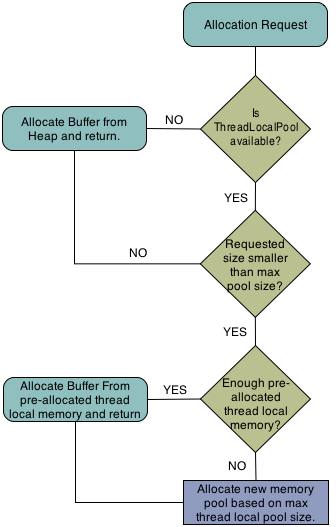

### 内存管理概述

Grizzly 2.0引入了一个新的子系统，以改善运行时的内存管理。该子系统由三个主要工件组成：

- 缓冲区 Buffers
- 线程本地内存池 Thread local memory pools
- MemoryManager, 作为工厂按序使用缓冲区和线程本地池

其主要目的是加快内存分配，并在可能的情况下提供内存重用。 
以下各节将详细描述这些概念。

### MemoryManager

MemoryManager 是分配和取消已经分配的 Buffer instance的主要接口：
```java
package org.glassfish.grizzly.memory;

import org.glassfish.grizzly.Buffer;
import org.glassfish.grizzly.monitoring.MonitoringAware;

/**
 * <tt>MemoryManager</tt>, responsible for allocating and releasing memory,
 * required during application runtime.
 * <tt>MemoryManager</tt> implementations work with Grizzly {@link Buffer}s.
 *
 * @see Buffer
 *
 * @author Alexey Stashok
 */
public interface MemoryManager<E extends Buffer>
        extends MonitoringAware<MemoryProbe> {

    /**
     * <p>
     * The default {@link MemoryManager} implementation used by all created builder
     * instances.
     * </p>
     *
     * <p>
     * The default may be changed by one of two methods:
     * <ul>
     *     <li>
     *          Setting the system property {@value MemoryManagerInitializer#DMM_PROP_NAME}
     *          with the fully qualified name of the class that implements the
     *          MemoryManager interface.  Note that this class must be public and
     *          have a public no-arg constructor.
     *     </li>
     *     <li>
     *         Setting the system property {@value DefaultMemoryManagerFactory#DMMF_PROP_NAME}
     *         with the fully qualified name of the class that implements the
     *         {@link org.glassfish.grizzly.memory.DefaultMemoryManagerFactory} interface.
     *         Note that this class must be public and have a public no-arg
     *         constructor.
     *     </li>
     * </ul>
     *
     * </p>
     */
    MemoryManager DEFAULT_MEMORY_MANAGER =
            MemoryManagerInitializer.initManager();

    /**
     * Allocated {@link Buffer} of the required size.
     *
     * @param size {@link Buffer} size to be allocated.
     * @return allocated {@link Buffer}.
     */
    E allocate(int size);

    /**
     * Allocated {@link Buffer} at least of the provided size.
     * This could be useful for usecases like Socket.read(...), where
     * we're not sure how many bytes are available, but want to read as
     * much as possible.
     *
     * @param size the min {@link Buffer} size to be allocated.
     * @return allocated {@link Buffer}.
     */
    E allocateAtLeast(int size);

    /**
     * Reallocate {@link Buffer} to a required size.
     * Implementation may choose the way, how reallocation could be done, either
     * by allocating new {@link Buffer} of required size and copying old
     * {@link Buffer} content there, or perform more complex logic related to
     * memory pooling etc.
     *
     * @param oldBuffer old {@link Buffer} to be reallocated.
     * @param newSize new {@link Buffer} required size.
     * @return reallocated {@link Buffer}.
     */
    E reallocate(E oldBuffer, int newSize);

    /**
     * Release {@link Buffer}.
     * Implementation may ignore releasing and let JVM Garbage collector to take
     * care about the {@link Buffer}, or return {@link Buffer} to pool, in case
     * of more complex <tt>MemoryManager</tt> implementation.
     *
     * @param buffer {@link Buffer} to be released.
     */
    void release(E buffer);
    
    /**
     * Return <tt>true</tt> if next {@link #allocate(int)} or {@link #allocateAtLeast(int)} call,
     * made in the current thread for the given memory size, going to return a {@link Buffer} based
     * on direct {@link java.nio.ByteBuffer}, or <tt>false</tt> otherwise.
     * 
     * @param size
     * @return 
     */
    boolean willAllocateDirect(int size);
}
```
通常只有一个MemoryManager服务于Grizzly运行时中定义的所有传输。可以通过引用MemoryManager接口的静态成员来获得此MemoryManager：
```shell
MemoryManager DEFAULT_MEMORY_MANAGER = MemoryManagerInitializer.initManager();
```
然而，可以通过定义系统属性org.glassfish.grizzly.DEFAULT_MEMORY_MANAGER来定义自定义MemoryManager实现，作为默认的MemoryManager，
该系统属性引用要使用的MemoryManager实现的完全限定的类名。请注意，此实现必须具有公共的无参数构造函数，以便运行时正确设置新的默认值。

Grizzly 2.3包含两个MemoryManager实现：HeapMemoryManager和ByteBufferManager。默认情况下，Grizzly运行时将使用HeapMemoryManager，
但是，如果Grizzly应用程序需要直接ByteBuffer访问，则可以使用ByteBufferManager。

#### ByteBufferManager
该ByteBufferManager实施VENDS grizzly 缓冲实例那套JDK的ByteBuffer实例。如果Grizzly应用程序需要直接使用ByteBuffer，则使用此MemoryManager。
应该注意的是，在进行基准测试期间，此 MemoryManager 通常在使用堆缓冲区时需要更多的开销。因此，如果不需要直接读取内存，我们建议使用默认的HeapMemoryManager。

#### HeapMemoryManager
HeapMemoryManager 是默认的 MemoryManager。代替包装 ByteBuffer 实例，此 MemoryManager 将分配直接包装字节数组的Buffer实例。
此 MemoryManager 为 trimming 或 splitting 之类的操作提供更好的性能特征。
     
#### ThreadLocal Memory Pools
ThreadLocal 内存池提供了无需任何同步成本即可分配内存的功能。无论是 ByteBufferManager 和 HeapMemoryManager 使用这些池。请注意，
不需要自定义 MemoryManager 使用此类池，但是，如果该 MemoryManager 实现 ThreadLocalPoolProvider 接口，则必须提供 ThreadLocalPool 实现。
该 ThreadLocalPool 执行将被创建并传递给每个通过 Grizzly 管理维持的线程。

#### Memory Manager and ThreadLocal Memory Pools Working Together
以下提供了使用ThreadLocalPool向MemoryManager分配请求通常如何工作的流程图：


#### 缓冲区 Buffers
Grizzly 2.3提供了一些缓冲区，供开发人员在创建应用程序时使用。这些Buffer实现一些功能，这些功能是使用JDK的ByteBuffer时没有的。

##### Buffer

该缓冲器本质上是模拟到JDK的字节缓冲区。它提供了以下相同的方法集：

- 向 Buffer 推入/拉出 (pushing/pulling) 数据。
- 用于访问或操纵缓冲区的位置(position)，限制(limit)和容量(capacity)的方法。

除了为ByteBuffer提供熟悉的语义外，还提供以下功能：
- 分割，修剪和缩小。 splitting, trimming and shrinking
- 在当前缓冲区之前添加另一个缓冲区的内容。 Prepending another Buffer's content to the current Buffer.
- 将缓冲区转换为ByteBuffer或ByteBuffer []。 Converting the Buffer to a ByteBuffer or ByteBuffer[].
- 将缓冲区内容转换为字符串。 Converting Buffer content to a String.

请参阅javadocs以获取有关Buffer的更多详细信息。

#### CompositeBuffer
该CompositeBuffer是另一个缓冲区实现它允许附加的缓冲实例。所述CompositeBuffer维护虚拟位置，限制和基于容量缓冲器已所附和可以被视为简单的缓冲液的实例。
有关CompositeBuffer的更多详细信息，请参见javadocs 。